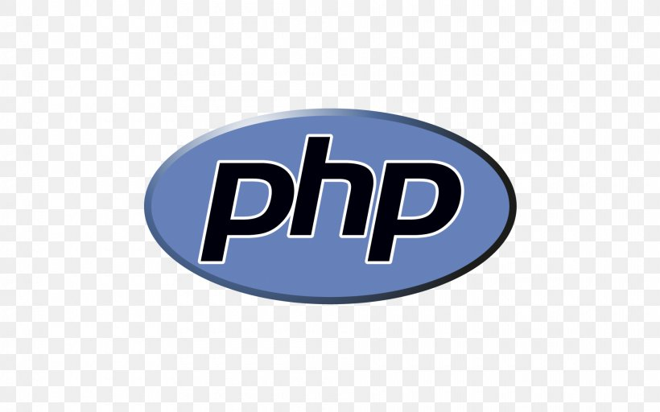
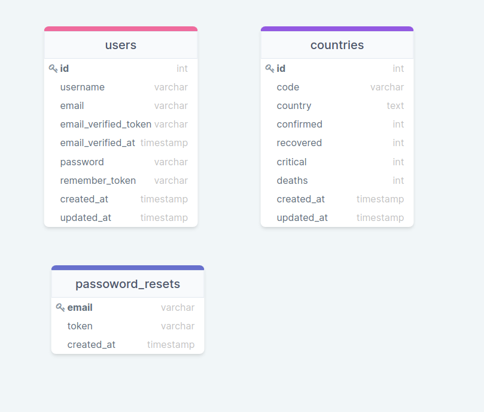

## Coronatime
<p align="left">
    // About for coronatime app
</p>

## Table of Contents

* [Prerequisites](#prerequisites)
* [Packages](#packages)
* [Getting started](#getting-started)
* [Database tables](#database-tables)
* [Resources](#resources)

## Prerequisites

*  *PHP@8.0 and up*
*  *npm@6 and up*
*  *composer@2.1.10*

## Packages

* [*livewere*](https://laravel-livewire.com/docs/2.x/quickstart)
* [*tailwindcss ^2.1.2*](https://tailwindui.com/documentation)
* [*alpinejs ^2.7.3*](https://alpinejs.dev/start-here)
* [*spatie/laravel-translatable ^4.4*](https://github.com/spatie/laravel-translatable)

## Getting started

1. First of all you need to clone this repository from github:

```sh
git clone https://github.com/RedberryInternship/tazokenkebashvili-coronatime.git
```

2. Next step requires from you to run *composer install* in order to install all the dependencies.

```sh
composer install
```

3. after you have installed all the PHP dependencies, it's time to install all the JS dependencies:

```sh
npm install
```

and also:
```sh
npm run dev
```

4. Now we need to set our env file. Go to the root of your project and execute this command.
```sh
cp .env.example .env
```
And now you should provide .env file all the necessary environment variables:

5. migrations

```sh
php artisan migrate
```

or if you need default data

```sh
php artisan migrate:fresh --seed
```

default:
* username: tazo
* email:    tazo@gmail.com
* password: password

#
### Database tables



#
### Resources

* [Figma Designs](https://www.figma.com/file/O9A950iYrHgZHtBuCtNSY8/Coronatime?node-id=0%3A1)
* [DrawSQL](https://drawsql.app/redberry-4/diagrams/coronatime)
